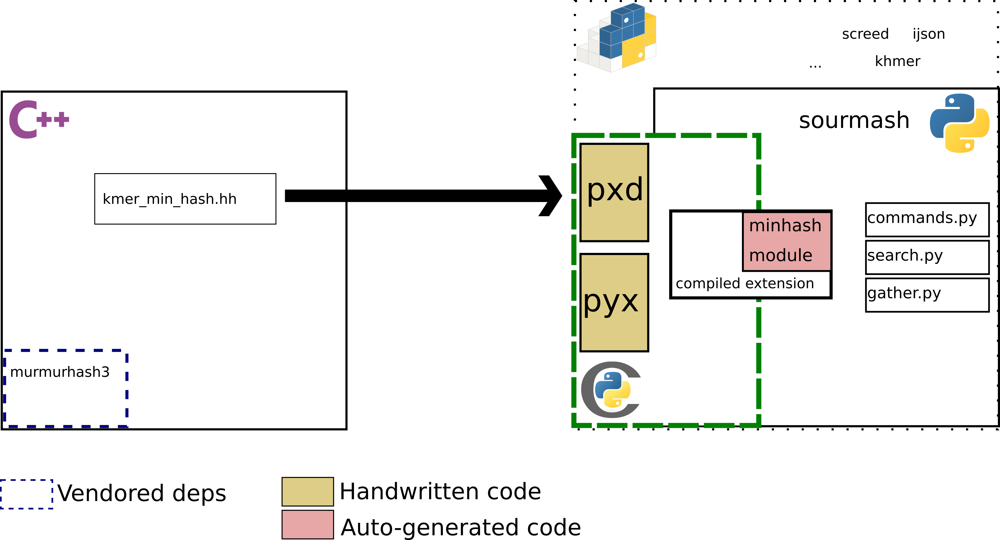

# Current implementation

## Pros

- Cython is a superset of Python
- Mature codebases for example usage and best practices
- Lower overhead to call C/C++ code
- NumPy integration
- Nice gradual path to migrate performance-intensive code from Python  to C/C++

## Cons

- Cython C++ integration has some corner cases and missing features
- Need to rewrite header declarations (pxd file)
- Errors can be cryptic (do they happen at the C/C++, Cython or Python level?)
- Many C/C++ build system combinations
- Vendored dependencies (no package mgmt)
- One wheel per OS and Python version
