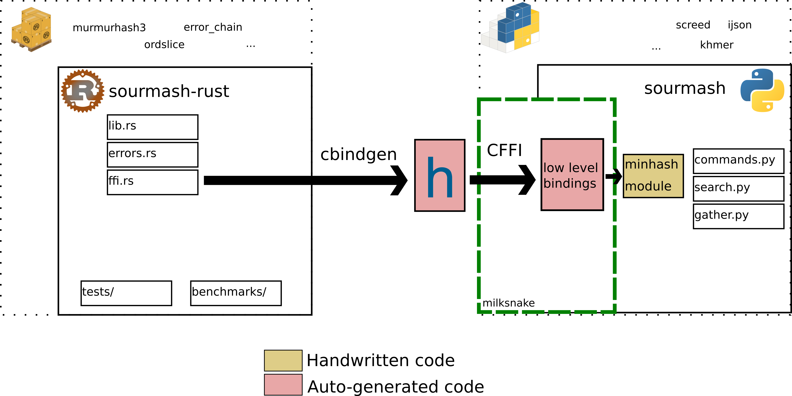

# Rust implementation

## Pros

- Cargo and crates.io for package management
- FFI interface is reusable in other languages
- Auto-generated C header (cbindgen) and low level bindings (CFFI)
- Works for PyPy too
- One wheel per OS (universal)

## Cons

- Fewer projects using Rust extensions
- FFI overhead when calling C code
- No gradual transition from Python to Rust code
- Fewer bioinformatics libraries available
- No NumPy integration
- Low level abstraction ("what C can represent")
